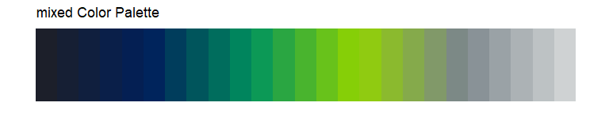
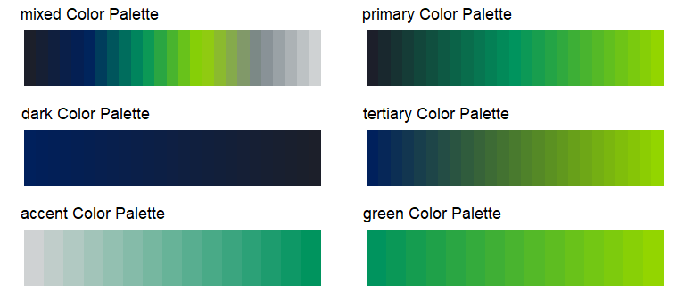
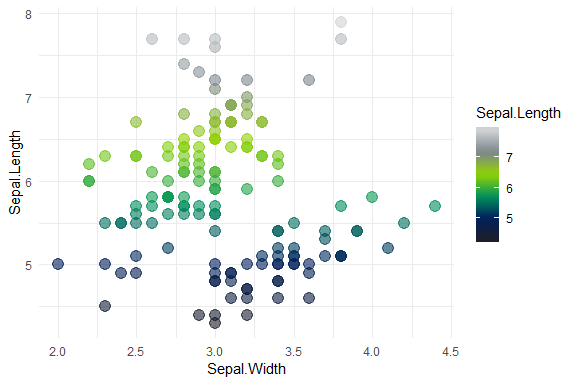
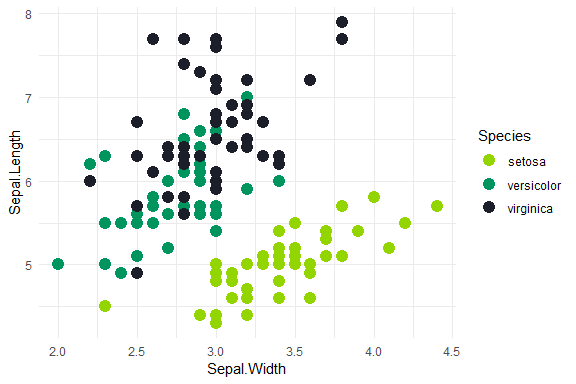

companycolors 
========================================================================

**`companycolors`** is an R helper package for using company-specific color palettes in charts.

### Usage

#### Pull list of company colors and HEX codes

``` r
measure_colors()
#> Lime Green       Navy     Hunter      Black       Gray      Taupe 
#>  "#93d500"  "#00205c"  "#00945e"  "#1c1f2a"  "#7b868c"  "#cfd2d3" 
#>        Web      White 
#>  "#eff0f1"  "#ffffff"
```

#### Find HEX code from specific color

``` r
measure_colors("Navy")
#>      Navy 
#> "#00205c"
```

#### Get shades between two colors

``` r
measure_palette("secondary", reverse = TRUE)(4)
#> [1] "#EFF0F1" "#C8CCCF" "#A1A9AD" "#7B868C"
```

#### Preview your color palettes

``` r
measure_palette_preview(palette = "mixed")
```





#### Plot!

``` r
ggplot(iris, aes(Sepal.Width, Sepal.Length, color = Sepal.Length)) +
    geom_point(size = 4, alpha = 0.6) +
    scale_color_measure(discrete = FALSE, palette = "mixed", reverse = TRUE)
```



``` r
ggplot(iris, aes(Sepal.Width, Sepal.Length, color = Species)) +
   geom_point(size = 4) +
   scale_color_measure(palette = "primary", reverse = FALSE)
```



### Credits

Based on this great @drsimonj [blog post](https://drsimonj.svbtle.com/creating-corporate-colour-palettes-for-ggplot2)
