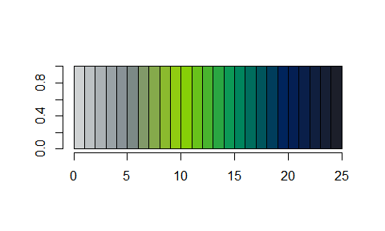

**company-colors** is an R helper package for using my company's color palette in charts.

### Usage

#### Pull list of company colors and HEX codes

``` r
measure_colors()
## Lime Green       Navy     Hunter      Black       Gray      Taupe 
##  "#93d500"  "#00205c"  "#00945e"  "#1c1f2a"  "#7b868c"  "#cfd2d3" 
##        Web      White 
##  "#eff0f1"  "#ffffff"
```

#### Find HEX code from specific color

``` r
measure_colors("Navy")
##      Navy 
## "#00205c"
```

#### Get shades between two colors

``` r
measure_palette("secondary", reverse = TRUE)(4)
## [1] "#EFF0F1" "#C8CCCF" "#A1A9AD" "#7B868C"
```

#### Plot!

``` r
ggplot(iris, aes(Sepal.Width, Sepal.Length, color = Sepal.Length)) +
    geom_point(size = 4, alpha = 0.6) +
    scale_color_measure(discrete = FALSE, palette = "accent", reverse = TRUE)
```



``` r
ggplot(iris, aes(Sepal.Width, Sepal.Length, color = Species)) +
   geom_point(size = 4) +
   scale_color_measure(palette = "accent", reverse = TRUE)
```


### Credits

Based on this great @drsimonj [blog post](https://drsimonj.svbtle.com/creating-corporate-colour-palettes-for-ggplot2)
